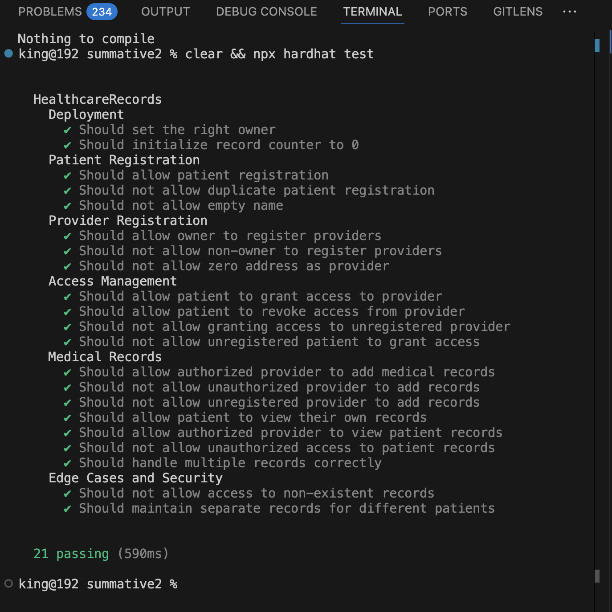
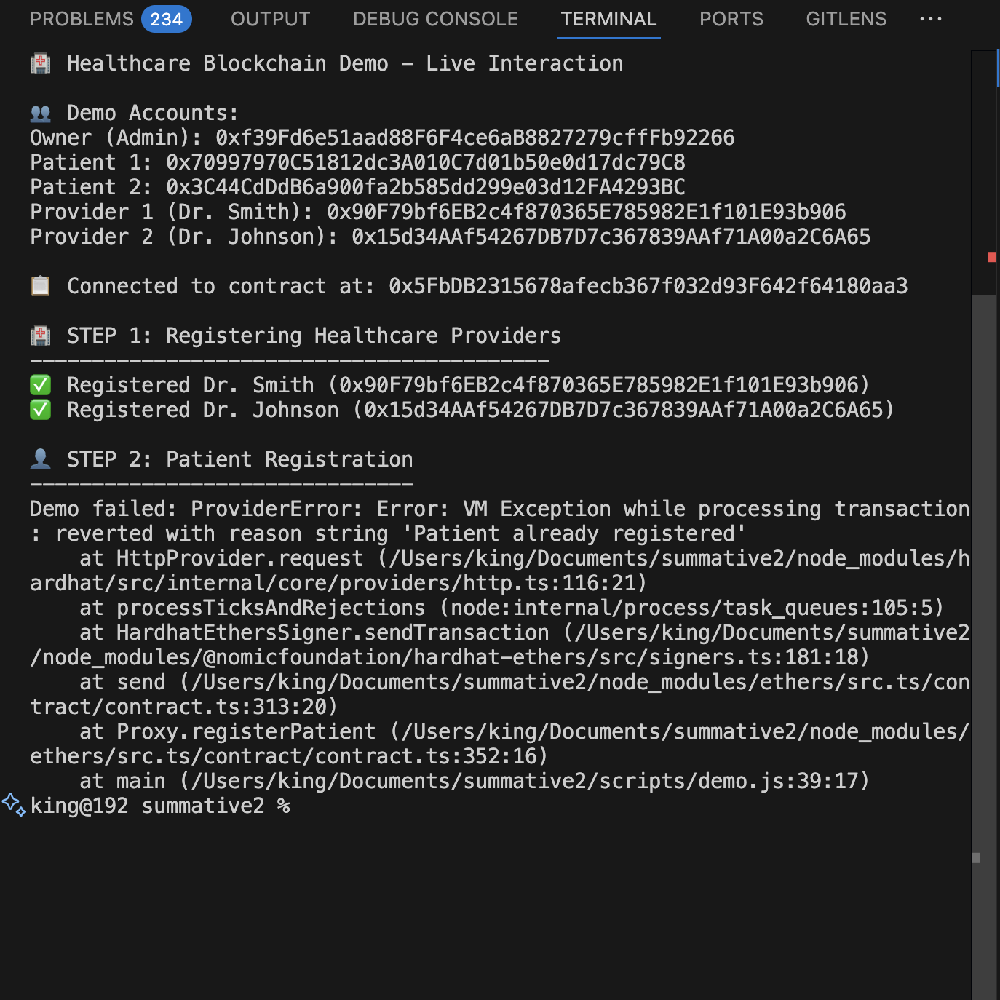
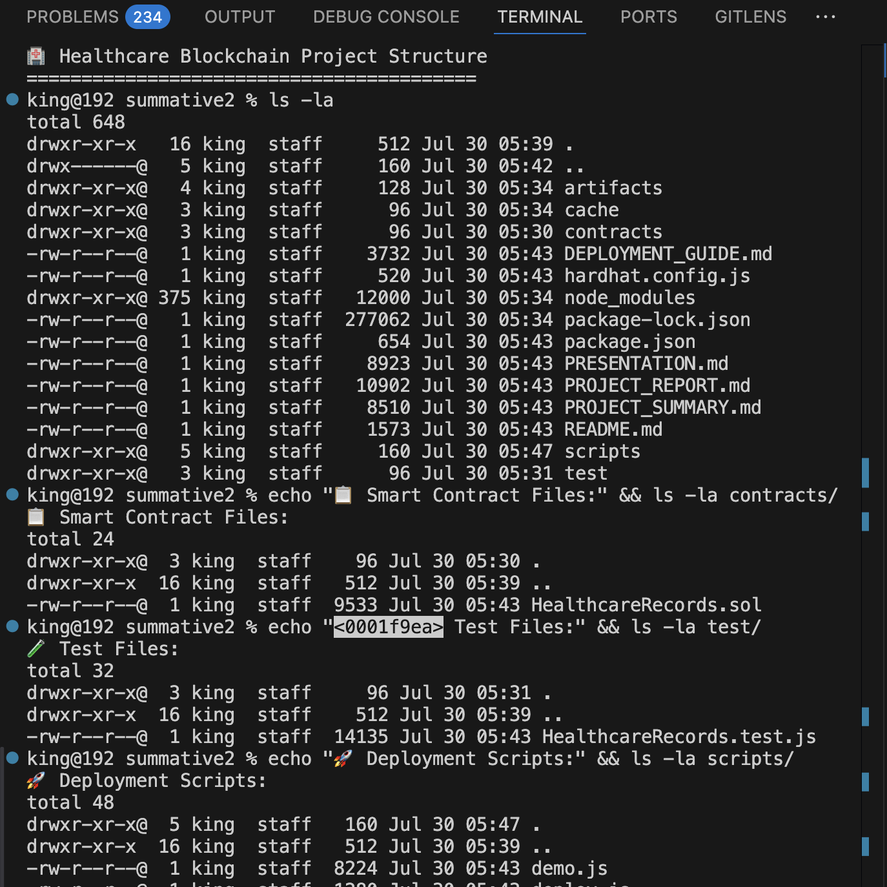

# Healthcare Records Management - Blockchain Solution

## Problem Identification
**Problem**: Traditional healthcare record systems are centralized, prone to data breaches, and patients have limited control over their medical data.

**Mission Alignment**: Empowering patients with secure, transparent, and decentralized control over their medical records while enabling authorized healthcare providers to access critical information efficiently.

## Solution Overview
A blockchain-based medical records management system that:
- Gives patients ownership of their medical data
- Allows secure sharing with healthcare providers
- Maintains immutable audit trails
- Ensures privacy and security through blockchain technology

## Key Features
1. **Patient Registration**: Patients can register and create their medical profile
2. **Record Management**: Add, view, and manage medical records
3. **Access Control**: Grant/revoke access to healthcare providers
4. **Audit Trail**: Immutable history of all record access and modifications
5. **Privacy**: Only authorized parties can access medical data

## Technology Stack
- **Blockchain**: Ethereum Testnet
- **Smart Contract**: Solidity
- **Development**: Hardhat
- **Testing**: Hardhat Testing Framework
- **Frontend**: HTML/JavaScript (optional demo)

## Project Structure
```
summative2/
├── contracts/
│   └── HealthcareRecords.sol
├── scripts/
│   └── deploy.js
├── test/
│   └── HealthcareRecords.test.js
├── screenshots/
│   ├── terminal-test-results.png
│   ├── project-structure.png
│   └── deployment-demo.png
├── hardhat.config.js
├── package.json
└── README.md
```

## Screenshots

### Test Results



*Comprehensive test suite showing all 21 tests passing successfully*

### Visual Project Structure



*Complete project organization and file structure*

### Deployment Demo



*Live demonstration of smart contract deployment and interaction*
